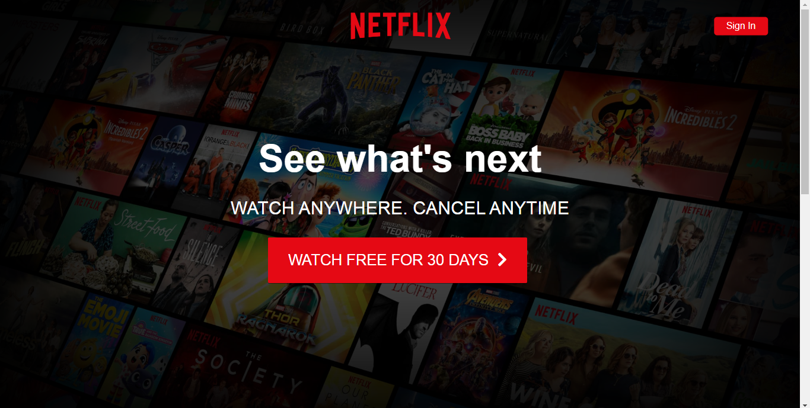
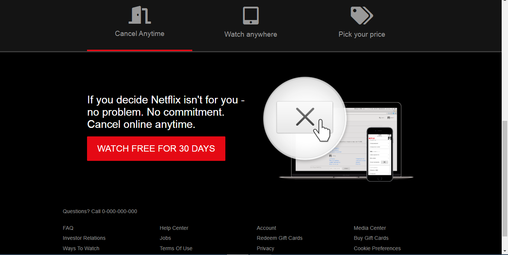
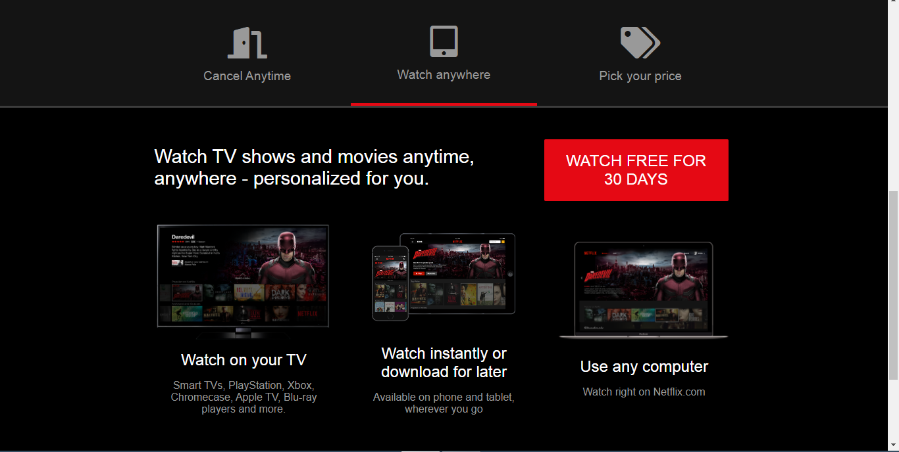
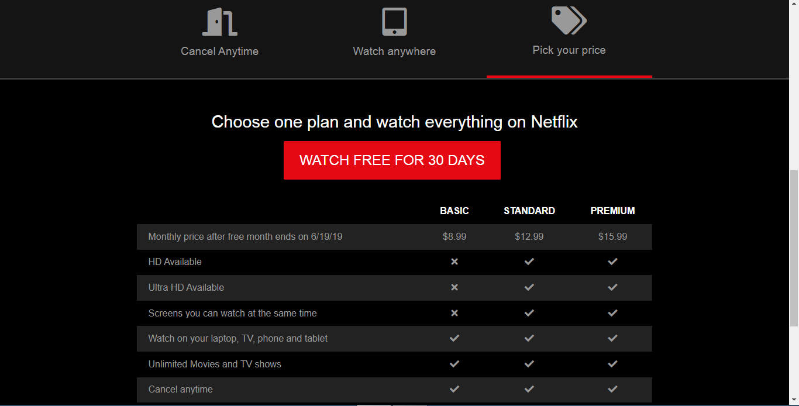

# Netflix Clone

## Introduction

Welcome to my simple Netflix clone project! This project is a basic HTML, CSS, and JS exercise where I aimed to recreate the Netflix homepage. It's a great way to practice fundamental web development skills and get hands-on experience with HTML, CSS, and a bit of JavaScript.

## Features

- Responsive design
- Tab-based content layout
- Stylish buttons and icons

## Screenshots

## Learning Points

Throughout the project, I gained experience in:

- Setting up a responsive layout with HTML and CSS
- Using Font Awesome for icons
- Creating and styling tabs with JavaScript
- Embedding images and using image assets
- Structuring HTML for different sections of the page

## How to Use

1. Clone this repository to your local machine.
2. Open the `index.html` file in your web browser to see the Netflix clone.

## Contributions

Contributions are welcome! Feel free to fork this repository, make changes, and submit pull requests. If you find any issues, please open an issue on the GitHub repository.

## Acknowledgments

- Font Awesome for providing awesome icons.
- Netflix for the original design inspiration.
- Thanks to anyone who takes the time to explore and contribute to this project!

---

_This project is for educational purposes only and is not affiliated with Netflix or any related entities._
